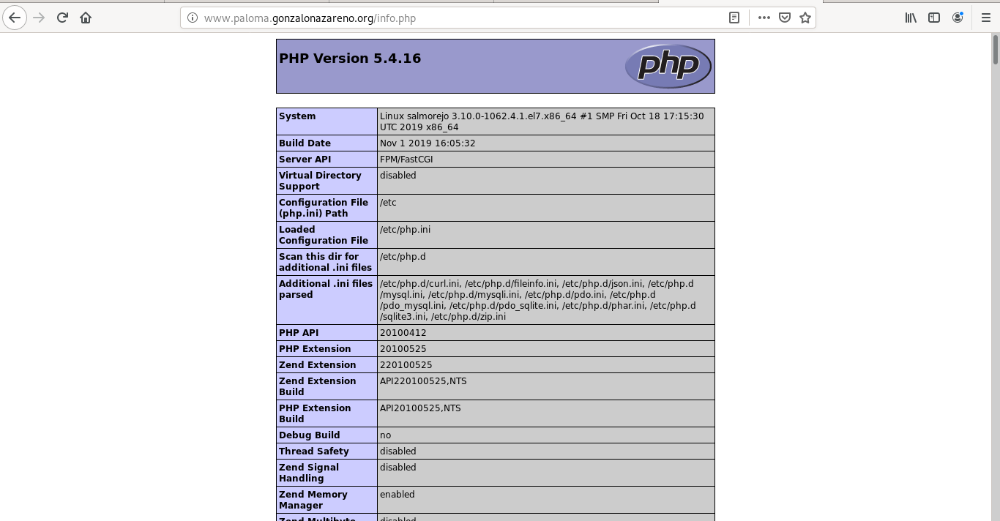

# Instalación de un servidor Web

Ante de realizar la instalación del servidor web vamos a configurar el nombre de nuestras máquinas, para ello:

- Piensa en un nombre de dominio, que sera un subdominio de gonzalonazareno.org, y que contenga tu nombre, por ejemplo: josedom.gonzalonazareno.org.
- Siguiendo con el ejemplo, los nombres de mis máquinas serán:

        croqueta.josedom.gonzalonazareno.org
        tortilla.josedom.gonzalonazareno.org
        salmorejo.josedom.gonzalonazareno.org

Comprueba que los servidores tienen configurados el nuevo nombre de dominio de forma adecuada después de volver a reiniciar el servidor (o tomar una nueva configuración DHCP). Para que el servidor tenga el FQDN debes tener configurado de forma correcta el parámetro domain en el fichero /etc/resolv.conf, además debemos evitar que este fichero se sobreescriba con los datos que manda el servidor DHCP de OpenStack. Quizás sea buena idea mirar la configuración de cloud-init. Documenta la configuración que has tenido que modificar y muestra el contenido del fichero /etc/resolv.conf y la salida del comando hostname -f después de un reinicio.

## Configuración inicial
### En Debian-croqueta
Configuracion /etc/hostname:
~~~
croqueta
~~~

Configuracion /etc/hosts:
~~~
127.0.1.1 croqueta.paloma.gonzalonazareno.org croqueta
127.0.0.1 localhost
~~~

Y se condigura /etc/dhcp/dhclient.conf:
~~~
supersede domain-name "paloma.gonzalonazareno.org";
supersede domain-search "paloma.gonzalonazareno.org";
~~~

Se reinicia y se comprueba se comprueba:
~~~
debian@croqueta:~$ hostname -f
croqueta.paloma.gonzalonazareno.org
debian@croqueta:~$ cat /etc/resolv.conf 
domain paloma.gonzalonazareno.org
search paloma.gonzalonazareno.org.
nameserver 192.168.202.2
~~~

### En Ubuntu-torilla
Configuracion /etc/hostname:
~~~
tortilla
~~~ 

Configuracion /etc/hosts:
~~~
127.0.1.1 tortilla.paloma.gonzalonazareno.org tortilla
127.0.0.1 localhost
~~~

Se configura /etc/systemd/resolver.conf
~~~
[Resolve]
DNS=192.168.202.2
#FallbackDNS=
Domains=paloma.gonzalonazareno.org
~~~

Se reinicia y se comprueba:
~~~
ubuntu@tortilla:~$ hostname -f
tortilla.paloma.gonzalonazareno.org
ubuntu@tortilla:~$ cat /etc/resolv.conf 
# This file is managed by man:systemd-resolved(8). Do not edit.
#
# This is a dynamic resolv.conf file for connecting local clients to the
# internal DNS stub resolver of systemd-resolved. This file lists all
# configured search domains.
#
# Run "systemd-resolve --status" to see details about the uplink DNS servers
# currently in use.
#
# Third party programs must not access this file directly, but only through the
# symlink at /etc/resolv.conf. To manage man:resolv.conf(5) in a different way,
# replace this symlink by a static file or a different symlink.
#
# See man:systemd-resolved.service(8) for details about the supported modes of
# operation for /etc/resolv.conf.

nameserver 127.0.0.53
options edns0
search paloma.gonzalonazareno.org openstacklocal
~~~

### En Centos-salmorejo
Configuracion /etc/hostname:
~~~
salmorejo
~~~ 

Configuracion /etc/hosts:
~~~
127.0.0.1   salmorejo.paloma.gonzalonazareno.org salmorejo
~~~

Se añade el siguiente comando:
~~~
[centos@salmorejo ~]$ sudo hostnamectl set-hostname salmorejo --static
~~~

Se configura /etc/resolv.conf
~~~
search paloma.gonzalonazareno.org openstacklocal
~~~

Y no permitimos que se modifiquen:
~~~
[centos@salmorejo ~]$ sudo chattr +i /etc/resolv.conf
~~~

Se comprueba:
~~~
[centos@salmorejo ~]$ hostname -f
salmorejo.paloma.gonzalonazareno.org
[centos@salmorejo ~]$ cat /etc/resolv.conf
; Created by cloud-init on instance boot automatically, do not edit.
;
; generated by /usr/sbin/dhclient-script
search paloma.gonzalonazareno.org openstacklocal
nameserver 192.168.202.2
~~~

## Servidor Web
En salmorejo (CentOs 7) vamos a instalar un servidor web nginx. Configura el servidor para que sea capaz de ejecutar código php (para ello vamos a usar un servidor de aplicaciones php-fpm). Entrega una captura de pantalla accediendo a www.tunombre.gonzalonazareno.org/info.php donde se vea la salida del fichero info.php.

En primer lugar se añade el repositorio epel:
~~~
[centos@salmorejo ~]$ sudo yum install epel-release
~~~

Y se instala nginx:
~~~
[centos@salmorejo ~]$ sudo yum install nginx
~~~

Y se inicia nginx:
~~~
[centos@salmorejo ~]$ sudo systemctl start nginx
~~~

Con el siguiente comando se iniciará nginx cuando se incie la máquina:
~~~
[centos@salmorejo ~]$ sudo systemctl enable nginx
~~~

Se instalan los paquetes necesarios de php:
~~~
[centos@salmorejo ~]$ sudo yum install php php-mysql php-fpm
~~~

Se modifica el fichero /etc/php.ini, descomentando la siguiente línea:
~~~
cgi.fix_pathinfo=0
~~~

A continuación, se descomentan y configuran las siquientes líneas del fichero /etc/php-fpm.d/www.conf:
~~~
listen = /var/run/php-fpm/php-fpm.sock
listen.owner = nobody
listen.group = nobody
user = nginx 
; RPM: Keep a group allowed to write in log dir.
group = nginx
~~~

Se inicia el servicio de php:
~~~
[centos@salmorejo ~]$ sudo systemctl start php-fpm
~~~

Y con el siguiente comando se configura para que php-fpm se inicie junto con el inicio del sistema:
~~~
[centos@salmorejo ~]$ sudo systemctl enable php-fpm
~~~

A continuación, hay que crear el fichero /etc/nginx/conf.d/default.conf y se intruduce lo siguiente:
~~~
server {
    listen	 80;
    server_name  www.paloma.gonzalonareno.org;

    # note that these lines are originally from the "location /" block
    root   /usr/share/nginx/html;
    index index.php index.html index.htm;

    location / {
        try_files $uri $uri/ =404;
    }
    error_page 404 /404.html;
    error_page 500 502 503 504 /50x.html;
    location = /50x.html {
        root /usr/share/nginx/html;
    }

    location ~ \.php$ {
        try_files $uri =404;
        fastcgi_pass unix:/var/run/php-fpm/php-fpm.sock;
        fastcgi_index index.php;
        fastcgi_param SCRIPT_FILENAME $document_root$fastcgi_script_name;
        include fastcgi_params;
    }
}
~~~

Y se vuelve a restaurar nginx.
~~~
[centos@salmorejo ~]$ sudo systemctl restart nginx
~~~

Por último, se crea y modifica el fichero /usr/share/nginx/html/info.php
~~~
<?php phpinfo(); ?>
~~~

Se comprueba el funcionamiento:
> NOTA: añadir en el fichero /etc/hosts del cliente la dirección www.paloma.gonzalonareno.org en la ip correspondiente.

## Servidor de base de datos

En tortilla (Ubuntu) vamos a instalar un servidor de base de datos mariadb. Entrega una prueba de funcionamiento donde se vea como se realiza una conexión a la base de datos desde los otros dos equipos.

### En el servidor-tortilla
Se comienza instalando el gestor de bases de datos:
~~~
ubuntu@tortilla:~$ sudo apt install mariadb-server
~~~

Se comienza con las primeras configuraciones de los usuarios de la base de datos como añadir la contraseña del root y borrar los usuarios creados por defecto por MariaDB:
~~~
ubuntu@tortilla:~$ sudo mysql_secure_installation

NOTE: RUNNING ALL PARTS OF THIS SCRIPT IS RECOMMENDED FOR ALL MariaDB
      SERVERS IN PRODUCTION USE!  PLEASE READ EACH STEP CAREFULLY!

In order to log into MariaDB to secure it, we'll need the current
password for the root user.  If you've just installed MariaDB, and
you haven't set the root password yet, the password will be blank,
so you should just press enter here.

Enter current password for root (enter for none): 
OK, successfully used password, moving on...

Setting the root password ensures that nobody can log into the MariaDB
root user without the proper authorisation.

You already have a root password set, so you can safely answer 'n'.

Change the root password? [Y/n] y
New password: 
Re-enter new password: 
Password updated successfully!
Reloading privilege tables..
 ... Success!

By default, a MariaDB installation has an anonymous user, allowing anyone
to log into MariaDB without having to have a user account created for
them.  This is intended only for testing, and to make the installation
go a bit smoother.  You should remove them before moving into a
production environment.

Remove anonymous users? [Y/n] y
 ... Success!

Normally, root should only be allowed to connect from 'localhost'.  This
ensures that someone cannot guess at the root password from the network.

Disallow root login remotely? [Y/n] y
 ... Success!

By default, MariaDB comes with a database named 'test' that anyone can
access.  This is also intended only for testing, and should be removed
before moving into a production environment.

Remove test database and access to it? [Y/n] y
 - Dropping test database...
 ... Success!
 - Removing privileges on test database...
 ... Success!

Reloading the privilege tables will ensure that all changes made so far
will take effect immediately.

Reload privilege tables now? [Y/n] y
 ... Success!

Cleaning up...

All done!  If you've completed all of the above steps, your MariaDB
installation should now be secure.

Thanks for using MariaDB!
~~~

Para poder acceder a la base de datos de forma remota hay que modificar la siguiente línea del fichero /etc/mysql/mariadb.conf.d/50-server.cnf:
~~~
bind-address            = 0.0.0.0
~~~

Y se reinicia el servicio:
~~~
ubuntu@tortilla:~$ sudo systemctl restart mariadb.service 
~~~

Y se entra en Maria para:
1. Crear un usuario.
2. Crear una base de datos.
3. Añadir permisos para poder acceder con este usuario desde las direcciones de salmorejo y croqueta.
~~~
ubuntu@tortilla:~$ sudo mysql -u root
~~~

~~~
MariaDB [(none)]> create user 'ubuntuServ' identified by 'ubuntuServ';
Query OK, 0 rows affected (0.00 sec)
MariaDB [(none)]> create database tortillaDB;
Query OK, 1 row affected (0.00 sec)
MariaDB [(none)]> GRANT USAGE ON *.* TO 'ubuntuServ'@'%' IDENTIFIED BY 'ubuntuServ';
~~~

### En el cliente-croqueta

Se instala el paquete cliente de MariaDB:
~~~
debian@croqueta:~$ sudo apt install mariadb-client
~~~

Se prueba la conectividad:
~~~
debian@croqueta:~$ sudo mysql -u ubuntuServ -p tortillaDB -h 10.0.0.11
Enter password: 
Welcome to the MariaDB monitor.  Commands end with ; or \g.
Your MariaDB connection id is 31
Server version: 10.1.41-MariaDB-0ubuntu0.18.04.1 Ubuntu 18.04

Copyright (c) 2000, 2018, Oracle, MariaDB Corporation Ab and others.

Type 'help;' or '\h' for help. Type '\c' to clear the current input statement.

MariaDB [tortillaDB]> 
~~~

### En el cliente-salmorejo

Se instala el cliente de MariaDB:
~~~
[centos@salmorejo ~]$ sudo yum groupinstall -y mariadb-client
~~~

Y se prueba la conectividad:
~~~
[centos@salmorejo ~]$ sudo mysql -u ubuntuServ -p tortillaDB -h 10.0.0.11
Enter password: 
Welcome to the MariaDB monitor.  Commands end with ; or \g.
Your MariaDB connection id is 41
Server version: 10.1.41-MariaDB-0ubuntu0.18.04.1 Ubuntu 18.04

Copyright (c) 2000, 2018, Oracle, MariaDB Corporation Ab and others.

Type 'help;' or '\h' for help. Type '\c' to clear the current input statement.

MariaDB [tortillaDB]> 
~~~
